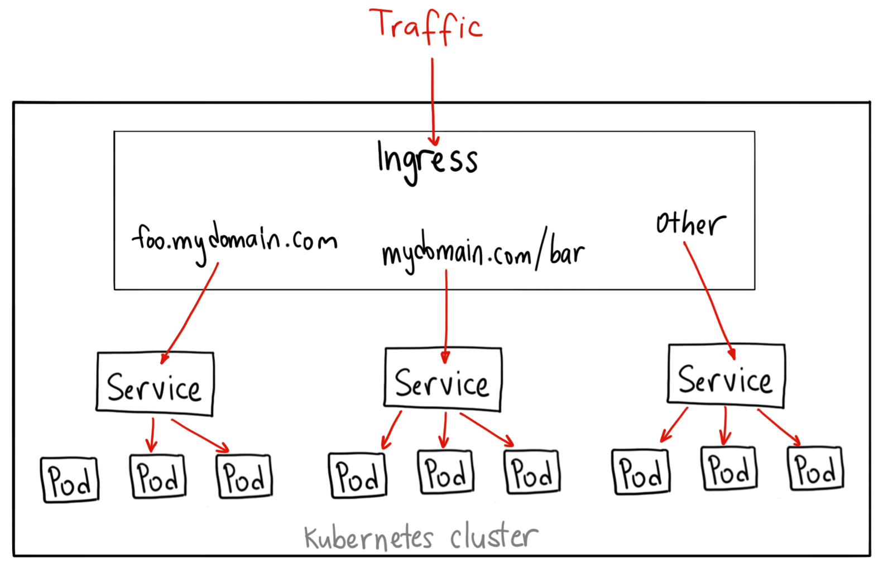

K[**ubernetes**](https://kubernetes.io/docs/concepts/overview/what-is-kubernetes/) **is an open-source system for automating deployment, scaling, and management of containerized applications.**

### Features

#### Service discovery and load balancing

#### Automatic binpacking

#### Storage orchestration

#### Self-healing

#### Automated rollouts and rollbacks

#### Secret and configuration management

#### Batch execution

#### Horizontal scaling

Pods and services in Kubernetes have their own IP; however, it is normally not the interface you’d provide to the external internet. Though there is service with node IP configured, the port in the node IP can’t be duplicated among the services. It is cumbersome to decide which port to manage with which service. Furthermore, the node comes and goes, it wouldn’t be clever to provide a static node IP to external service.

Ingress defines a set of rules that allows the inbound connection to access Kubernetes cluster services. It brings the traffic into the cluster at L7, allocates and forwards a port on each VM to the service port. This is shown in the following figure. We define a set of rules and post them as source type ingress to the API server. When the traffic comes in, the ingress controller will then fulfill and route the ingress by the ingress rules. As shown in the following figure, ingress is used to route external traffic to the kubernetes endpoints by different URLs:

](./asset-1.png)

**Setup:**

Install Virtualbox

Install kubectl

```
brew install kubernetes-cli
```

Install minikube

```
brew cask install minikube
minikube start
```

**Get all namespaces**

```
kubectl get namespaces
```

**Create new namespace**

namespace-balram.json

```
{
 “kind”: “Namespace”,
 “apiVersion”: “v1”,
 “metadata”: {
 “name”: “balram”,
 “labels”: {
 “name”: “balram”
 }
 }
}
```

**Run command**

```
kubectl create -f namespace-balram.json
```

ref: [https://kubernetes.io/docs/tasks/administer-cluster/namespaces-walkthrough/](https://kubernetes.io/docs/tasks/administer-cluster/namespaces-walkthrough/)

See Kubectl config

```
kubectl config view
```

I got below response

```
apiVersion: v1

clusters:

- cluster:

certificate-authority: /Users/balsingh1/.minikube/ca.crt

server: https://192.168.99.101:8443

name: minikube

contexts:

- context:

cluster: minikube

user: minikube

name: minikube

current-context: minikube

kind: Config

preferences: {}

users:

- name: minikube

user:

client-certificate: /Users/balsingh1/.minikube/client.crt

client-key: /Users/balsingh1/.minikube/client.keyapiVersion: v1
```

Run

```
kubectl config current-context
```

Got response

```
minikube
```

The next step is to define a context for the kubectl client to work in each namespace. The value of “cluster” and “user” fields are copied from the current context.

```
kubectl config set-context dev --namespace=balram \

>   --cluster=minikube \

>   --user=minikube
```

Response

```
Context "dev" created.
```

Recheck config

```
kubectl config viewGot response
```

Response

```
apiVersion: v1

clusters:

- cluster:

certificate-authority: /Users/balsingh1/.minikube/ca.crt

server: https://192.168.99.101:8443

name: minikube

contexts:

- context:

cluster: minikube

namespace: balram

user: minikube

name: dev

- context:

cluster: minikube

user: minikube

name: minikube

current-context: minikube

kind: Config

preferences: {}

users:

- name: minikube

user:

client-certificate: /Users/balsingh1/.minikube/client.crt

client-key: /Users/balsingh1/.minikube/client.key
```

Let’s switch to operate in the development namespace.

```
kubectl config use-context dev
```

You can verify your current context by doing the following:

```
kubectl config current-context
```

response

```
dev
```

At this point, all requests we make to the Kubernetes cluster from the command line are scoped to the balram namespace.

Let’s create some contents.

```
kubectl run snowflake --image=kubernetes/serve_hostname --replicas=2
```

We have just created a deployment whose replica size is 2 that is running the pod called snowflake with a basic container that just serves the hostname. Note that `**kubectl run**` creates deployments only on Kubernetes cluster >= v1.2. If you are running older versions, it creates replication controllers instead. If you want to obtain the old behavior, use `**--generator=run/v1**` to create replication controllers. See `[**kubectl run**](https://kubernetes.io/docs/reference/generated/kubectl/kubectl-commands/#run)`for more details.

```
kubectl get deployment
```

Response

```
NAME        DESIRED   CURRENT   UP-TO-DATE   AVAILABLE   AGE

snowflake   2         2         2            2           1m

kubectl get pods -l run=snowflake
```

response

```
NAME                         READY   STATUS    RESTARTS   AGE

snowflake-54fccfcd67-dflkh   1/1     Running   0          8m

snowflake-54fccfcd67-lww4w   1/1     Running   0          8m
```

Ingress



ref

[https://kubernetes.io/docs/concepts/workloads/pods/pod/](https://kubernetes.io/docs/concepts/workloads/pods/pod/ "https://kubernetes.io/docs/concepts/workloads/pods/pod/")

[https://kubernetes.io/docs/concepts/workloads/controllers/deployment/](https://kubernetes.io/docs/concepts/workloads/controllers/deployment/)

[https://kubernetes.io/docs/concepts/services-networking/service/](https://kubernetes.io/docs/concepts/services-networking/service/ "https://kubernetes.io/docs/concepts/services-networking/service/")

[**Ingress**  
_Edit This Page An API object that manages external access to the services in a cluster, typically HTTP. Ingress can…_kubernetes.io](https://kubernetes.io/docs/concepts/services-networking/ingress/ "https://kubernetes.io/docs/concepts/services-networking/ingress/")[](https://kubernetes.io/docs/concepts/services-networking/ingress/)

[**Kubernetes NodePort vs LoadBalancer vs Ingress? When should I use what?**  
_Recently, someone asked me what the difference between NodePorts, LoadBalancers, and Ingress were. They are all…_medium.com](https://medium.com/google-cloud/kubernetes-nodeport-vs-loadbalancer-vs-ingress-when-should-i-use-what-922f010849e0 "https://medium.com/google-cloud/kubernetes-nodeport-vs-loadbalancer-vs-ingress-when-should-i-use-what-922f010849e0")[](https://medium.com/google-cloud/kubernetes-nodeport-vs-loadbalancer-vs-ingress-when-should-i-use-what-922f010849e0)

Command to get IP of service if it is saying pending in kubectl get services

minikube service list
