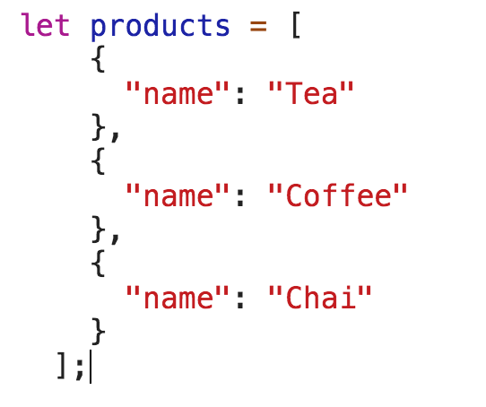
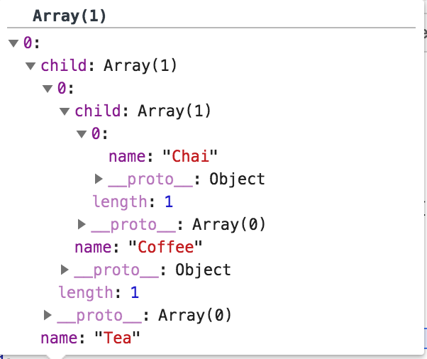

First step is to convert flat array into Hierarchy

```
const hierarchy = products.reduceRight((child, obj) => {
 if (child) {
  return [Object.assign({}, obj, { child })];
 }
 return [obj];
 }, null);
```

This will return



---

```
const renderHierarchy = child => child.map(hierarchy => (
 <Node node={hierarchy}>
 {hierarchy.child}
 </Node>
));
```

**Node.jsx**

```
import React from ‘react’;
import PropTypes from ‘prop-types’;

const propTypes = {
 children: PropTypes.array,
 node: PropTypes.object,
};

const defaultProps = {
 children: null,
 node: <div />,
};

export default function Node({ children, node }) {
 let childnodes = null;

// the Node component calls itself if there are children
 if (children) {
 childnodes = children.map(childnode => (
 <Node node={childnode} >
 {childnode.child}
 </Node>
 ));
 }

// return our list element
 // display children if there are any
 return (
 <li key={node.id}>
 <span>{node.name}</span>
 { childnodes ?
 <ul>{childnodes}</ul>
 : null }
 </li>
 );
}

Node.propTypes = propTypes;
Node.defaultProps = defaultProps;
```

**Test your output**


