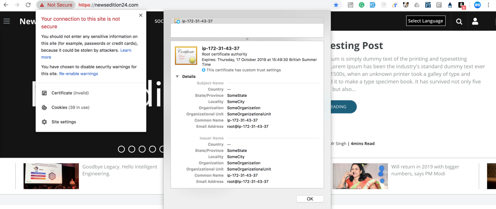
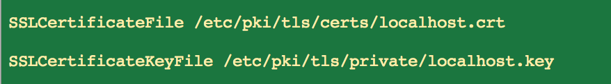

**Problem:** I created few certificates for my website and one of them got active and i am not sure which one is active and how to delete it.

**Solution:** Go to ssl.conf in below location and update path of new certificate

location of SSL files are in file

etc/httpd/conf.d

cat ssl.conf | grep -v ‘#’

